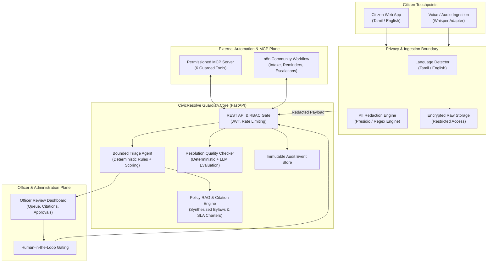

# System Architecture: CivicResolve Guardian

## 1. Overview
**CivicResolve Guardian** coordinates citizen touchpoints, bounded AI triage agents, grounded policy RAG retrieval, human officer approval gates, and automated resolution verification into an auditable, high-assurance civic governance platform.

---

## 2. Component Topology

---

## 3. Data Flow Stages

1. **Ingestion & Privacy Sanitization**:
   - Citizen provides textual or voice grievance in Tamil (தமிழ்) or English.
   - PII Detection Engine scrubs phone numbers, Aadhaar/IDs, person names, and door numbers.
   - Original unredacted text is stored in the **Restricted Vault**. Redacted representation is stored in the public/AI processing database.
2. **Grounded Policy Retrieval (RAG)**:
   - Evaluates grievance text against 5 indexed municipal bylaws.
   - Requires similarity score >= 0.50. If no policy passes threshold, declares `insufficient_evidence`.
3. **Bounded Triage State Machine**:
   - Classifies department and priority with deterministic rule anchors.
   - Computes duplicate similarity against open cases in the same ward.
   - Flags missing evidence items.
   - Enforces `approval_required: true`.
4. **Human-in-the-Loop Officer Approval**:
   - Officer reviews recommendations side-by-side with citations.
   - Approves routing or provides explicit override reason.
   - Case transitions to `ROUTED_ASSIGNED`.
5. **Resolution Veracity Verification**:
   - Officer submits action summary and completion photo.
   - Resolution Quality Auditor verifies deterministic constraints and runs contradiction detection.
   - Verdict rendered: `likely_resolved`, `weak_resolution`, `insufficient_evidence`, or `contradiction_detected`.
